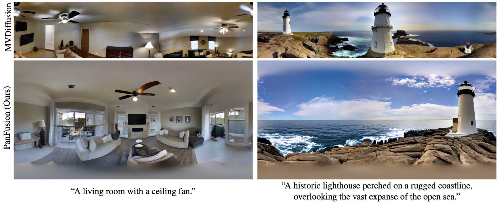

# PanFusion

### Taming Stable Diffusion for Text to 360° Panorama Image Generation
Cheng Zhang, Qianyi Wu, Camilo Cruz Gambardella, Xiaoshui Huang, Dinh Phung, Wanli Ouyang, Jianfei Cai

### [Project Page](https://chengzhag.github.io/publication/panfusion) | [Paper](https://arxiv.org/abs/2404.07949)



## Introduction

This repo contains data preprocessing, training, testing, evaluation code of our CVPR 2024 paper.

## Installation

We use Anaconda to manage the environment. You can create the environment by running the following command:

```bash
git clone https://github.com/chengzhag/PanFusion
cd PanFusion
conda env create -f environment.yaml
conda activate panfusion
```

If you are having issue with conda solving environment, or any other issues that might be caused by the version of the packages, you can try to create the environment with specific version of the packages:

```bash
conda env create -f environment_strict.yaml
```

We use [wandb](https://www.wandb.com/) to log and visualize the training process. You can create an account then login to wandb by running the following command:

```bash
wandb login
```

We provide the wandb [report](https://wandb.ai/pidan1231239/pano_diffusion/reports/PanFusion--Vmlldzo3NzM1OTYy?accessToken=mmneovtrelnqd21gw5sk2cp8j0av65meohuf0ua850398sivq7duvkcvu934qlbt) for identifying issues when reproducing the results.

## Demo

You can download the pretrained checkpoints [last.ckpt](https://monashuni-my.sharepoint.com/:u:/g/personal/cheng_zhang_monash_edu/EeTrujeSOgdHh7vWsjXuMPAB8JtTaXS1uR8sp0y1kwQ4NQ?e=cI5jec) and put it in the `logs/4142dlo4/checkpoints` folder. Then run the following command to test the model:

```bash
WANDB_MODE=offline WANDB_RUN_ID=4142dlo4 python main.py predict --data=Matterport3D --model=PanFusion --ckpt_path=last
```

The generated images are saved in the `logs/4142dlo4/predict` folder.

We also provide out-of-domain prompts for testing:

```bash
WANDB_MODE=offline WANDB_RUN_ID=4142dlo4 python main.py predict --data=Demo --model=PanFusion --ckpt_path=last
```

## Data Preparation

### Download Data

We follow [MVDiffusion](https://github.com/Tangshitao/MVDiffusion) to download the [Matterport3D](https://niessner.github.io/Matterport/) skybox dataset. Specifically, please fill the sign the form to request a download script `download_mp.py` and put it in the `data/Matterport3D` folder. Then run the following command to download and unzip the data:

```bash
cd data/Matterport3D
python download_mp.py -o ./Matterport3D --type matterport_skybox_images
python unzip_skybox.py
```

We also use the [splits](https://www.dropbox.com/scl/fi/recc3utsvmkbgc2vjqxur/mp3d_skybox.tar?rlkey=ywlz7zvyu25ovccacmc3iifwe&dl=0) provided by [MVDiffusion](https://github.com/Tangshitao/MVDiffusion). Please download it to `data/Matterport3D` and unzip it with the following command:

```bash
cd data/Matterport3D
tar -xvf mp3d_skybox.tar
```

### Stitch Matterport3D Skybox

The Matterport3D skybox images are stitched into equirectangular projection images for training. Please run the following command to stitch the images:

```bash
python -m scripts.stitch_mp3d
```

The stitched images are saved in the `data/Matterport3D/mp3d_skybox/*/matterport_stitched_images` folder.

### Caption Images

We use the perspective image captions generated by [MVDiffusion](https://github.com/Tangshitao/MVDiffusion) for evaluation. Please download the captions [mp3d_skybox.tar](https://www.dropbox.com/scl/fi/recc3utsvmkbgc2vjqxur/mp3d_skybox.tar?rlkey=ywlz7zvyu25ovccacmc3iifwe&dl=0) and put it in the `data/Matterport3D` folder. Then run the following command to unzip the captions:

```bash
cd data/Matterport3D
tar -xvf mp3d_skybox.tar
```

We use blip to caption the equirectangular images for training. You can download the generated captions [mp3d_stitched_caption.tar](https://monashuni-my.sharepoint.com/:u:/g/personal/cheng_zhang_monash_edu/Ec1A8tOmt_5ItvT2aktSUioBHzC_LRYjqaHPqipJuUhPHw?e=BgDGhL) and put it in the `data/Matterport3D` folder. Then run the following command to unzip the captions:

```bash
cd data/Matterport3D
tar -xvf mp3d_stitched_caption.tar
```

<details>
<summary>Do it yourself</summary>

Alternatively, you can use the following command to generate the captions yourself:

```bash
python -m scripts.caption_mp3d
```

</details>
<br>

### Render Layout

We use the [Matterport3DLayoutAnnotation](https://github.com/ericsujw/Matterport3DLayoutAnnotation) dataset to render the layout for layout-conditioned panorama generation. You can download the generated layout renderings [mp3d_layout.tar](https://monashuni-my.sharepoint.com/:u:/g/personal/cheng_zhang_monash_edu/EQK5DP7LwWdOvhVjFER6dSsB255dUJknnVuNFROBEaWgjA?e=97UQEI) and put it in the `data/Matterport3D` folder. Then run the following command to unzip the layout renderings:

```bash
cd data/Matterport3D
tar -xvf mp3d_layout.tar
```

<details>
<summary>Do it yourself</summary>

Alternatively, you can run the following command to download the layout labels and render the layout yourself:

```bash
cd data
git clone https://github.com/ericsujw/Matterport3DLayoutAnnotation
cd Matterport3DLayoutAnnotation
unzip label_data.zip
cd ../..
python -m scripts.render_layout
```

</details>
<br>

### Align Matterport3D Images

The [Matterport3DLayoutAnnotation](https://github.com/ericsujw/Matterport3DLayoutAnnotation) is annotated using [PanoAnnotator](https://github.com/SunDaDenny/PanoAnnotator?tab=readme-ov-file#pre-process) tool. Before annotating, the Matterport3D images are Manhattan-aligned using this Matlab [tool](https://drive.google.com/file/d/1u6E5dT6zqFZsoLdV9ys-m0YJ9G3dtij7/view). Please download the tool to `external` folder and unzip with the following command:

```bash
cd external
unzip preprocess.zip
```

Then run our provided Matlab script `preprocess_mp3d.m` to align the Matterport3D images.

## Training and Testing

### FAED

We train FAED model to evaluate the quality of the generated panorama images. You can download a pretrained checkpoint [faed.ckpt](https://monashuni-my.sharepoint.com/:u:/g/personal/cheng_zhang_monash_edu/EWMxyeTXtjlPnd7zmT36XqsBkmvLo_wxCmeKVAWIWTqUWg?e=Rtq1a4) and put it in the `weights` folder.

<details>
<summary>Do it yourself</summary>

Alternatively, you can train the FAED model yourself by running the following command:

```bash
WANDB_NAME=faed python main.py fit --data=Matterport3D --model=FAED --trainer.max_epochs=60 --data.batch_size=4
```

Then copy the checkpoint to the `weights` folder and rename for later use.
The training takes about 4 hours on a single NVIDIA A100 GPU.

</details>
<br>

**Hint**: Experiment is logged and visualized to wandb under the `panfusion` project. You'll get a `WANDB_RUN_ID` (e.g., `ek6ab466`) after running the command. Or you can find it in the wandb dashboard. The checkpoints are saved in the `logs/<WANDB_RUN_ID>/checkpoints` folder. Same for the following experiments.

### HorizonNet

We train HorizonNet model to evaluate layout-conditioned panorama generation. You can download a pretrained checkpoint [horizonnet.ckpt](https://monashuni-my.sharepoint.com/:u:/g/personal/cheng_zhang_monash_edu/EYXsKsKuUqVLhfBgsnglKMIBgmVw9dvDVDUTH5l6wMZROg?e=gF1FW5) and put it in the `weights` folder.

<details>
<summary>Do it yourself</summary>

Alternatively, you can download the official checkpoint [resnet50_rnn__st3d.pth](https://drive.google.com/file/d/1JcHwSlYVbrXW1oh37ze7sEvW9asPdI3A/view?usp=share_link) to the `weights` folder and finetune the HorizonNet model yourself by running the following command:

```bash
WANDB_NAME=horizonnet python main.py fit --data=Matterport3D --model=HorizonNet --data.layout_cond_type=distance_map --data.horizon_layout=True --data.batch_size=4 --data.rand_rot_img=True --trainer.max_epochs=10 --model.ckpt_path=weights/resnet50_rnn__st3d.pth --data.num_workers=32
```

Then copy the checkpoint to the `weights` folder and rename for later use.
The training takes about 3 hours on a single NVIDIA A100 GPU.

</details>
<br>

### Text-to-Image Generation

We train the text-to-image generation model by running the following command:

```bash
WANDB_NAME=panfusion python main.py fit --data=Matterport3D --model=PanFusion
```

The training takes about 7 hours on 4x NVIDIA A100 GPU. The log is available at [wandb](https://wandb.ai/pidan1231239/pano_diffusion/runs/ad8103n1?nw=nwuserpidan1231239).

Assuming the `WANDB_RUN_ID` is `PANFUSION_ID`, you can test the model by running the following command:

```bash
WANDB_RUN_ID=<PANFUSION_ID> python main.py test --data=Matterport3D --model=PanFusion  --ckpt_path=last
WANDB_RUN_ID=<PANFUSION_ID> python main.py test --data=Matterport3D --model=EvalPanoGen
```

The test results will be saved in the `logs/<PANFUSION_ID>/test` folder and the evaluation results will be logged to wandb.

### Layout-conditioned Panorama Generation

Based on the trained text-to-image generation model, we further finetune a ControlNet model for layout-conditioned panorama generation:

```bash
WANDB_NAME=panfusion_lo python main.py fit --data=Matterport3D --model=PanFusion --trainer.max_epochs 100 --trainer.check_val_every_n_epoch 10 --model.ckpt_path=logs/<PANFUSION_ID>/checkpoints/last.ckpt --model.layout_cond=True --data.layout_cond_type=distance_map --data.uncond_ratio=0.5
```

Assuming the `WANDB_RUN_ID` is `PANFUSION_ID`, you can test the model by running the following command:

```bash
WANDB_RUN_ID=<PANFUSION_LO_ID> python main.py test --data=Matterport3D --model=PanFusion --ckpt_path=last --model.layout_cond=True --data.layout_cond_type=distance_map
WANDB_RUN_ID=<PANFUSION_LO_ID> python main.py test --data=Matterport3D --model=EvalPanoGen --data.manhattan_layout=True
```

## Citation

If you find our work helpful, please consider citing:

```bibtex
@inproceedings{panfusion2024,
  title={Taming Stable Diffusion for Text to 360◦ Panorama Image Generation},
  author={Zhang, Cheng and Wu, Qianyi and Cruz Gambardella, Camilo and Huang, Xiaoshui and Phung, Dinh and Ouyang, Wanli and Cai, Jianfei},
  booktitle={Proceedings of the IEEE/CVF Conference on Computer Vision and Pattern Recognition},
  year={2024}
}
```
